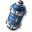
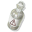
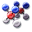
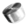
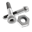
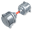

# Goods and Factories

There are 54 good (resouce) types and 41 factory types in the game.

## Resources

License price is calculated as 170×L^3+270×L^2, where L is a level. At the finish line all license prices are halved.

 ID | Phase | Level | License price  | Name                                                                                   | Factory
----|-------|-------|----------------|----------------------------------------------------------------------------------------|---------------------------------------------------------------
 1  | 1     | 1     | <s>M</s>440    |  Salze                                         | Salzbergwerk
 2  | 1     | 2     | <s>M</s>2440   |  Siliziumdioxid                      | Silikatmine
 3  | 1     | 3     | <s>M</s>7020   |  Blei                                            | Bleimine
 4  | 1     | 1     | <s>M</s>440    |  Nahrung                                      | Lebensmittellabor
 5  | 1     | 1     | <s>M</s>440    |  Wasser                                       | Wasserwerk, Chemiefabrik
 6  | 1     | 2     | <s>M</s>2440   |  Salzlösung                     | Labor
 7  | 1     | 2     | <s>M</s>2440   |  Nährlösung                   | Biozucht
 8  | 1     | 2     | <s>M</s>2440   |  Biomasse                                 | Bioreaktor
 9  | 1     | 1     | <s>M</s>440    |  Wasserstoff                          | Elektrolyse
 10 | 1     | 1     | <s>M</s>440    |  Sauerstoff                              | Elektrolyse
 11 | 1     | 2     | <s>M</s>2440   |  Kohlenstoffdioxid        | Verflüssigungsanlage, Siliziumraffinerie, Wärmekraftwerk
 12 | 1     | 3     | <s>M</s>7020   |  Atemluft                                     | Luftproduktion
 13 | 2     | 3     | <s>M</s>7020   |  Kohlenstoff                            | Graphitmine
 14 | 2     | 4     | <s>M</s>15200  |  Glas                                           | Glaswerk
 15 | 2     | 3     | <s>M</s>7020   |  Schwefelsäure                 | Bleimine
 16 | 2     | 4     | <s>M</s>15200  |  Salpetersäure                   | Chemiefabrik
 17 | 2     | 3     | <s>M</s>7020   |  Stickstoff                            | Verflüssigungsanlage
 18 | 2     | 4     | <s>M</s>15200  |  Ammoniak                                 | Ammoniakreaktor
 19 | 3     | 5     | <s>M</s>28000  |  Silizium                                 | Siliziumraffinerie
 20 | 3     | 7     | <s>M</s>71540  |  Algen                                       | Bioreaktor
 21 | 3     | 5     | <s>M</s>28000  |  Nitroglycerin                 | Nitroglycerinfabrik
 22 | 3     | 7     | <s>M</s>71540  |  Dünger                                  | Düngerfabrik
 23 | 3     | 5     | <s>M</s>28000  |  Chlor                                      | Elektrolyse
 24 | 3     | 7     | <s>M</s>71540  |  Ozon                                           | Ozonizer
 25 | 4     | 7     | <s>M</s>71540  |  Aluminium                             | Erzmine
 26 | 4     | 9     | <s>M</s>145800 |  Kunststoff                            | Kunststofffabrik
 27 | 4     | 7     | <s>M</s>71540  |  Polymer                                   | Polymerfabrik
 28 | 4     | 9     | <s>M</s>145800 |  Flüssigkristall            | Kristallisierer
 29 | 4     | 7     | <s>M</s>71540  |  Argon                                         | Verflüssigungsanlage
 30 | 4     | 9     | <s>M</s>145800 |  Methan                                     | Biogasanlage
 31 | 5     | 8     | <s>M</s>104320 |  Lithium                                   | Erzmine
 32 | 5     | 10    | <s>M</s>197000 |  Solarmodul                         | Solarzellenfabrik
 33 | 5     | 8     | <s>M</s>104320 |  Spezialkleber                          | Klebstofffabrik
 34 | 5     | 10    | <s>M</s>197000 |  Treibstoff                          | Treibstoffraffinerie
 35 | 5     | 8     | <s>M</s>104320 |  Lachgas                             | Chemiefabrik
 36 | 5     | 10    | <s>M</s>197000 |  Ethin                                        | Ethinfabrik
 37 | 6     | 10    | <s>M</s>197000 |  Titanium                                | Erzmine
 38 | 6     | 11    | <s>M</s>258940 |  Akkus                                     | Akkufabrik
 39 | 6     | 10    | <s>M</s>197000 |  Wärmeleitpaste            | Technikmanufaktur
 40 | 6     | 11    | <s>M</s>258940 |  Hydrauliköl                   | Hydraulikfabrik
 41 | 6     | 10    | <s>M</s>197000 |  Helium                                      | Biogasanlage
 42 | 6     | 11    | <s>M</s>258940 |  Fluor                                      | Fluorraffinerie
 43 | 7     | 11    | <s>M</s>258940 |  Werkzeuge                                 | Titanfabrik
 44 | 7     | 12    | <s>M</s>332640 |  Hydraulik                       | Titanfabrik
 45 | 7     | 11    | <s>M</s>258940 |  Kühlflüssigkeit                   | Kühlmittelfabrik
 46 | 7     | 12    | <s>M</s>332640 |  Medizin                                  | Medizinfabrik
 47 | 7     | 11    | <s>M</s>258940 |  Leuchtmittel                      | Leuchtmittelfabrik
 48 | 7     | 12    | <s>M</s>332640 |  Fernwärme                      | Wärmekraftwerk
 49 | 8     | 12    | <s>M</s>332640 |  Brennstoffzellen              | Brennstoffzellenfabrik
 50 | 8     | 12    | <s>M</s>332640 |  Mikrochips                          | Halbleiterfertigungsanlage
 51 | 8     | 12    | <s>M</s>332640 |  Vitaminpräparate | Medizinfabrik
 52 | 8     | 12    | <s>M</s>332640 |  Hygieneartikel                   | Medizinfabrik
 53 | 8     | 12    | <s>M</s>332640 |  Lasergas                                | Lasergasfabrik
 54 | 8     | 12    | <s>M</s>332640 |  Brennstoff                       | BSZGas-Produktion

## Factories

 ID | Phase | Name                       | Produced                                                                                                                                                                                                          | Consumed
----|-------|----------------------------|-------------------------------------------------------------------------------------------------------------------------------------------------------------------------------------------------------------------|---------------------------------------------------------------------------------------------------------------------------------------------------------------------------------------------------------------------------------------------------------
 1  | 1     | Salzbergwerk               |  Salze                                                                                                                                                                    |
 2  | 1     | Silikatmine                |  Siliziumdioxid                                                                                                                                                 |
 3  | 1     | Bleimine                   |  Blei  Schwefelsäure                                                                                                |
 4  | 1     | Lebensmittellabor          |  Nahrung                                                                                                                                                                 |  Salze  Wasser
 5  | 1     | Wasserwerk                 |  Wasser                                                                                                                                                                  |
 6  | 1     | Labor                      |  Salzlösung                                                                                                                                                |  Salze  Wasser
 7  | 1     | Biozucht                   |  Nährlösung                                                                                                                                              |  Nahrung  Salzlösung
 8  | 1     | Bioreaktor                 |  Biomasse  Algen                                                                                                           |  Nährlösung  Kohlenstoffdioxid
 9  | 1     | Elektrolyse                |  Wasserstoff  Sauerstoff  Chlor                                         |  Wasser  Salze
 10 | 1     | Verflüssigungsanlage       |  Kohlenstoffdioxid  Stickstoff  Argon                        |  Atemluft
 11 | 1     | Luftproduktion             |  Atemluft                                                                                                                                                                |  Sauerstoff
 12 | 2     | Graphitmine                |  Kohlenstoff                                                                                                                                                       |
 13 | 2     | Glaswerk                   |  Glas                                                                                                                                                                      |  Siliziumdioxid
 14 | 2     | Chemiefabrik               |  Salpetersäure  Wasser  Lachgas                                  |  Ammoniak  Sauerstoff
 15 | 2     | Ammoniakreaktor            |  Ammoniak                                                                                                                                                            |  Stickstoff  Wasserstoff
 16 | 3     | Siliziumraffinerie         |  Silizium  Kohlenstoffdioxid                                                                            |  Siliziumdioxid  Kohlenstoff
 17 | 3     | Nitroglycerinfabrik        |  Nitroglycerin                                                                                                                                            |  Salpetersäure  Schwefelsäure
 18 | 3     | Düngerfabrik               |  Dünger                                                                                                                                                             |  Ammoniak
 19 | 3     | Ozonizer                   |  Ozon                                                                                                                                                                      |  Sauerstoff
 20 | 4     | Erzmine                    |  Aluminium  Lithium  Titanium                                           |
 21 | 4     | Kunststofffabrik           |  Kunststoff                                                                                                                                                       |  Polymer
 22 | 4     | Polymerfabrik              |  Polymer                                                                                                                                                              |  Biomasse
 23 | 4     | Kristallisierer            |  Flüssigkristall                                                                                                                                       |  Polymer
 24 | 4     | Biogasanlage               |  Methan  Helium                                                                                                              |  Biomasse  Kohlenstoffdioxid  Wasserstoff
 25 | 5     | Solarzellenfabrik          |  Solarmodul                                                                                                                                                    |  Silizium  Aluminium  Flüssigkristall
 26 | 5     | Klebstofffabrik            |  Spezialkleber                                                                                                                                                     |  Polymer  Wasser
 27 | 5     | Treibstoffraffinerie       |  Treibstoff                                                                                                                                                     |  Methan
 28 | 5     | Ethinfabrik                |  Ethin                                                                                                                                                                   |  Wasserstoff  Kohlenstoff
 29 | 6     | Akkufabrik                 |  Akkus                                                                                                                                                                |  Lithium  Kohlenstoff
 30 | 6     | Technikmanufaktur          |  Wärmeleitpaste                                                                                                                                       |  Polymer  Silizium
 31 | 6     | Hydraulikfabrik            |  Hydrauliköl                                                                                                                                              |  Polymer  Wasser
 32 | 6     | Fluorraffinerie            |  Fluor                                                                                                                                                                 |  Schwefelsäure
 33 | 7     | Titanfabrik                |  Werkzeuge  Hydraulik                                                                                           |  Titanium  Kunststoff  Kohlenstoff  Hydrauliköl
 34 | 7     | Kühlmittelfabrik           |  Kühlflüssigkeit                                                                                                                                              |  Stickstoff  Wärmeleitpaste
 35 | 7     | Medizinfabrik              |  Medizin  Vitaminpräparate  Hygieneartikel |  Nitroglycerin  Chlor  Nahrung  Salzlösung
 36 | 7     | Leuchtmittelfabrik         |  Leuchtmittel                                                                                                                                                 |  Argon  Fluor  Salze
 37 | 7     | Wärmekraftwerk             |  Fernwärme  Kohlenstoffdioxid                                                                 |  Methan  Sauerstoff
 38 | 8     | Brennstoffzellenfabrik     |  Brennstoffzellen                                                                                                                                         |  Aluminium  Polymer
 39 | 8     | Halbleiterfertigungsanlage |  Mikrochips                                                                                                                                                     |  Silizium  Werkzeuge  Kunststoff  Flüssigkristall
 40 | 8     | Lasergasfabrik             |  Lasergas                                                                                                                                                           |  Argon  Helium
 41 | 8     | BSZGas-Produktion          |  Brennstoff                                                                                                                                                  |  Methan  Sauerstoff  Wasser  Treibstoff
