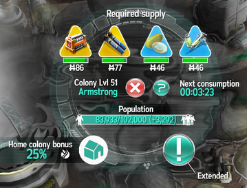

# Развитие колонии

В колонию можно поставлять товары (ресурсы) и получать за это деньги. Однако основные игровые очки - террапункты
(terrapoints) можно получить за поставку только четырёх требуемых в данный момент колонии товаров.

На каждом уровне свой набор требуемых товаров. При повышении уровня один из товаров (самый старый из выпавших ранее)
уходит и заменяется на один из новых товаров, который ранее не требовался колонии. Но, конечно, в игре всего 54 товара,
и на 51 уровне выпадет последний, а дальше начнут запрашиваться случайные товары из ранее выпадавших.

На первом уровне колония требует 4 товара с самых ближайших производств: водород, кислород, соль и еда. Можно легко
определить, сколько товаров уже открыла колония: L+3, где L - уровень. Конечно, общее число не может превысить 54.

В каждой фазе (кроме последней, 8 фазы) максимальный уровень колонии ограничен числом ресурсов, которые в этой фазе
появляются. Однако если колония не получила максимальный уровень до начала очередной фазы, то выпасть в следующей
фазе ей может любой из новых ресурсов, нет такого правила, что новые ресурсы могут выпасть только после исчерпания
всех старых.

Поставляемые товары потребляются каждые пять минут - из запаса на складе колонии изымается некоторый процент. Поэтому
если совсем прекратить поставку товара, его запас начнёт постепенно убывать. Размер склада растёт с ростом уровня,
так что нужно поставлять всё больше и больше, чтобы преодолеть потребление колонии.

Запасы подсвечиваются зелёным, когда их уровень превышает 50% размера склада. Если все товары позеленели, то в колонию
начинают прибывать колонисты. Чем больше запас превышает 50% размера склада, тем быстрее прибывают колонисты. Если запас
какого-либо товара упадёт ниже 50%, то прирост прекратится, более того, количество колонистов начнёт убывать. Поэтому
необходимо поддерживать достаточный завоз всех четырёх ресурсов всё время повышения уровня. После набора требуемого
количества колонистов колония повысит уровень (level up, поэтому на жаргоне это называют "ап колонии") и заменит
один из старых требуемых товаров на новый.

Пример апа колонии с высоким запасом на складах. Тут по тенденции ап случится примерно через полчаса. Как это можно
узнать? Тенденция - это прирост за стандартные отчётные 5 минут. В данном случае осталось дождаться прибытия ещё
102000-83933=18067 колонистов, с учётом тенденции +3292 получится 18067/3292≈5.5 пятиминуток, итого 5×6=30 минут.

Чем выше уровень колонии, тем сложнее его увеличить. Дело в том, что склад ресурсов колонии и требуемое количество
колонистов с каждым уровнем всё выше. Поэтому развитие колонии неотрывно связано с развитием игроков: повышение уровня
ангара и соответствующее расширение парка транспортёров, исследования и покупка улучшениых версий транспортёров,
получение новых более эффективных [плагинов](plugins.md), итд итп. Надо ещё понимать, что более поздние товары могут
находиться дальше от колонии и требовать более длинных цепочек [подвоза](supply.md). И новые ресурсы часто выпадают
на нераскачанных производствах с высоким [ВЗ](wt.md).

За поставки требуемых ресурсов поставщики получают террапункты. Чем выше уровень колонии, тем больше террапунктов
можно получить. Разумеется, топовые поставщики получают больше всех, но даже за один рейс и последнее место в
рейтинге можно что-то получить.

Начисление происходят каждые 6 часов, начиная со старта сервера. По МСК это будет в 0, 6, 12, 18 часов при старте
сервера летом и 1, 7, 13, 19 часов зимой (важный нюанс, что серверами управляют немецкие админы, а в Германии
практикуется переход на летнее время, который в России упразднили).

В домашней колонии можно получить на 25% больше террапунктов. В связи с этим смена домашней колонии требует 6 часов
(на x2-сервере - 3 часа). Иначе бы игроки часто переставляли домашнюю колонию перед апом, чтобы быстро срубить
дополнительных террапунктов.

Дополнительно по итогам [КпК](cvc.md) (соревнований колоний) можно получить ещё один бонус до 50% в зависимости
от достигнутого колонией места.

## Ап колонии после 52 уровня

В игре всего 54 товара, и последний выпадает на 51 уровне. На 52 уровне неизбежно выпадет один из ранее выпадавших
ресурсов, а это значит, что его производство уже будет раскачанным. В связи с этим уходит один из двух главных
ограничителей на рост колонии - и апы начинают идти веселее. Конечно, склад колонии и потребность в колонистах
с каждым уровнем всё равно продолжат расти, поэтому быстрый неограниченный рост по-прежнему невозможен.
