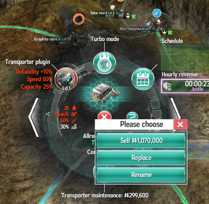

# Новая фаза

Итак, прогремели очередные 10 дней раунда (а у кого-то и 5), наступила новая фаза. Что делать?

Во-первых, надо организовать строительство новых производств, потому что при очередном апе
колонии может выпасть один из новых ресурсов. Строительство занимает время. Поэтому членам гильдии
надо раскидать свои стандартные и (при их наличии) строительные дроны, чтобы они начали стройку.
Частично стройку можно также подбить инвестициями, хоть это может быть не особо выгодно по деньгам,
которые с начала новой фазы нужны будут на другие цели.

Если вдруг не повезло и новый ресурс всё же выпал до окончания стройки, то все перекидывают на это
производство свои дроны для ускорения строительства. И по возможности инвестируют.

Во-вторых нужно запустить стройку ангара. Который в прошлой фазе уже должен быть максимального
уровня. Тут есть нюанс: ангар строится долго, поэтому если нет аккаунта поселенца с возможностью
стройки двух зданий одновременно, то можно рассмотреть вариант отложить стройку и поставить её в
ночь. Разумеется, следует заранее накопить денег к старту новой фазы.

Вариант досрочного строительства ангара за тритий рассматривать не будем, это опция не для простых
смертных :)

В-третьих, следует начать изучение транспортёра новой фазы. Для чего к началу новой фазы очки
исследования (микроскопы) должны быть заполнены на всю вместимость исследовательского института.
Но по тому, как проводить исследования и как сочетать это с обновлением транспортёров есть нюанс,
о котором речь дальше.

В-четвёртых, надо будет заменить старые транспортёры на новые. Но есть тот самый нюанс. Дело в том,
что стоковые (без улучшений) транспортёры хуже транспортёра предыдущей фазы. С другой стороны,
если транспортёр сначала купить, а потом исследовать улучшения, то это выйдет дешевле (улучшенный
транспортёр стоит дороже, в то же время улучшение уже купленного происходит бесплатно). Поэтому
есть две основные стратегии. Первая заключается в том, чтобы исследовать сам транспортёр без
улучшений, произвести полную замену, а затем вложить остатки микроскопов в улучшения. Недостатком
является недополучение доходов, пока характеристики нового транспортёра не будут исследованы
на достаточном уровне, чтобы оправдать снижение доходов по сравнению со старым полностью улучшенным.
В любом случае, новые транспортёры на новые слоты ангара придётся покупать уже по повышенной цене.
Вторая стратегия состоит в замене только тогда, когда новый транспортёр станет уже однозначно лучше
старого. Но при этом возникнет вопрос окупаемости его более высокой цены.

Возможны комбинированные варианты. Например, один из игроков придерживается стратегии замены на
следующий день к утренней гонке. Можно провести замену на заработанные за ночь деньги, а также
не тратиться на ремонт транспортёров, ведь новые всегда имеют износ 100% (то есть отсутствие
износа) - самое оно для гонки.

Лично мне понравился первый вариант. В некоторых фазах замена выполняется за отрицательную сумму,
то есть выливается в доход!

Кстати, если кто ещё не нашёл, замену (replace) можно удобно производить через меню под
восклицательным знаком у транспортёра. Старый будет продан, новый куплен, а из банка изъята
разница. Как уже выше отмечалось, иногда эта разница отрицательна. Дополнительно транспортёр
сохраняет текущий маршрут и установленный плагин, что крайне приятно, ведь вручную расставлять
плагины и создавать заново маршруты довольно утомительно.

