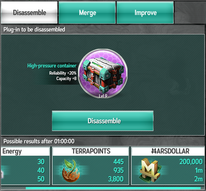
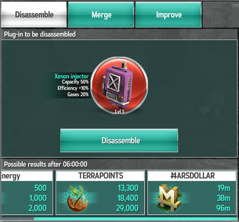
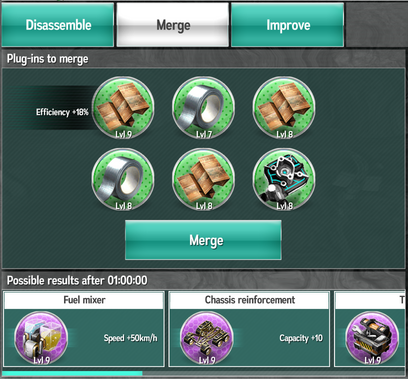
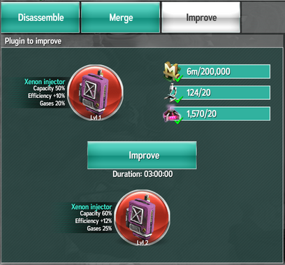

# Плагины (модули)

Плагины - специальные модули, которые расширяют возможности транспортёров и игрока. Важно подбирать хороший набор плагинов, это
позволит играть более успешно, быстрее развиваться, быстрее перевозить ресурсы, больше зарабатывать итд итп, в конченом счёте
достигая более высоких результатов.

## Типология плагинов

Каждый плагин предназначен либо для транспортёра (transport plugin), либо для игрока (player plugin). Можно считать, что плагин
игрока - это плагин к его скафандру.

По своему классу плагины подразделяются на:

- Обычные (normal, зелёные);
- Высокотехнологичные (hi-tech, фиолетовые);
- Прототипы (prototype, жёлтые);
- Артефакты (artifact, красные).

У некоторых плагинов может быть ограничен срок действия (durability). Плагины для транспортёров обычно неограничены, а вот
плагины для игрового персонажа - особенно самые хорошие - часто ограничены по времени. Плагин без ограничения времени можно
снять, а вот плагин с ограниченным сроком действия при попытке снятия сразу же уничтожается (даже если его срок жизни ещё
не истёк).

У плагинов есть уровни, чем выше уровень плагина, тем лучше его характеристики. Повысить уровень плагина можно либо через
улучшение (только для красных плагинов), либо через изначальную сборку плагинов не самых низких уровней.

## Лимиты слотов

У каждого обычного транспортёра всего один слот под плагин. У прототипов (премиумных транспортёров) - два.

У игрока всего 8 слотов. Два обычных (белых), два премиумных (жёлтых) - они требуют наличия активного аккаунта поселенца - и
4 особых - для особых красных плагинов - "пожертвованных от Gamefabrik" (Gamefabrikplugins, donated from developers).

## Заморочки интерфейса

К сожалению, в мобильной игре в фабрике вообще не показывается срок действия плагинов. Но плагины ограниченного срока действия
отличаются  более широкой серой рамкой. Отличить плагины игрока от плагинов транспортёра напрямую нельзя вообще.

Зато в мобильном интерфейсе более адекватно, чем в браузерной версии, показываются слоты игрока. В браузере слот появляется
только тогда, когда есть подходящие плагины (и при отсутствии аккаунта поселенца жёлтые слоты только мешают). А в мобилке
видно все 8 слотов сразу.

## Получение плагинов

Простейший способ получить плагины - купить их в магазине за чатлы. Раз в сутки там выпадают 4 новых зелёных плагина.
Иногда там встречаются и фиолетовые. Как правило, имеет смысл покупать самые дешёвые (в 1 фазе - максимум за <s>M</s>1000) и
с помощью [видеорекламы](ads.md) получить следующие 4 плагина, из них покупать самые дешёвые, и так далее.

Покупать в магазине ежедневные плагины за тритий, которые там иногда появляются, смысла нет - слишком дорого и никак не
оправданно. Также, как правило, не имеет смысла покупать фиолетовые плагины. Но тут есть исключение: если цена фиолетового
плагина не более чем в 6 раз превышает цену дешёвого зелёного, то его тоже можно купить. Например, при приемлемой цене
зелёных в 100 тыс. чатлов можно покупать фиолетовые с ценой до 1.2 миллиона. Но такие цены встречаются редко.

Кроме того, плагины выпадают в контейнерах и ежедневных бонусах.

По итогам раунда все игроки, не пропускавшие ежедневные бонусы, получат один красный плагин на следующий раунд. Также
обладатели первых 10 мест получат дополнительно ещё один призовой за свои заслуги. В частности, топ-1 получает плагин с
эффектом "мобильный гараж", который даёт дополнительный слот в ангар.

## Фабрика плагинов

Для переработки плагинов есть [фабрика плагинов](habitat/pluginfactory.md).

## Разборка

Разобрав (disassemble) плагин, можно получить некоторое количество энергии, террапунктов или чатлов. Не особо много, на самом
деле, и шанс на высший грейд не очень велик Эта операция в целом невыгодна.

Просто сравните, что можно получить при разборке фиолетового и красного плагинов:

 

## Слияние плагинов

На втором уровне фабрики плагинов можно использовать слияние (merge). Если взять 6 плагинов, то через некоторое время можно
будет получить плагин следуюшего класса. Время слияния зависит от класса плагина:

- Слияние зелёных в один фиолетовый - 1 час;
- Слияние фиолетовых в один жёлтый - 12 часов;
- Слияние жёлтых в один красный - 48 часов.

Собственно, именно ради слияния и имеет смысл покупать даже самые неинтересные плагины в магазине.

Следует очень внимательно следить за тем, какой плагин ставится в слиянии первым. Он определяет, какой тип плагина получится -
транспортёра или игрока - а также от него наследуется срок действия плагина. Вряд ли имеет смысл собирать из плагинов
неограниченного действия один плагин со сроком 1 час, только лишь из-за невнимательности поставив ограниченный плагин в
первый слот.

В слоты, кроме первого, можно ставить любые плагины (игрока или транспортёра), их срок действия не будет унаследован
в результате.

Ежедневно собирая плагины из магазина и других источников, можно выполнять их слияние и образовывать плагины следующего класса.
В результате можно набрать несколько красных плагинов. Полностью с нуля это сделать, конечно, сложно, ведь один красный плагин
потребует 6 жёлтых, 36 фиолетовых или 216 зелёных. Если орентироваться на 4 ежедневных зелёных, это потребует 54 дня - больше
половины раунда. Так что имеет смысл смотреть видеорекламу в соответствующем разделе магазина, это позволит увеличить количество
получаемых плагинов.

## Улучшение плагинов

Ещё одна возможность, которая откроется после апгрейда фабрики плагинов до третьего уровня. Улучшать (improve) можно только
артефакты (красные плагины). Улучшение требует использования чатлов, очков исследования и энергии. Чем выше уровень, тем больше
надо. В отличие от слияния, тут нет рулетки с случайным выбором характеристик - насколько улучшится плагин известно сразу.

Обычные артефакты улучшаются от 6 часов, особые артефакты от разработчиков улучшаются дольше. Время улучшения растёт с уровнем.

## Самые важные плагины

Самым интересным плагином является "мобильный гараж" (mobile garage), который даёт дополнительный слот к ангару. Это красный
плагин игрока (особый артефакт), который можно получить только в контейнерах. Если его улучшить до 10 уровня, то он будет
давать уже 2 слота.

Кроме него, бывает жёлтый плагин "стартовый гараж" (starter garage) с ограниченным сроком действия (240 часов, то есть 10 суток).
Его улучшить нельзя. Одна из возможных стратегий - вставить его на конец раунда и вставить за 10 дней до окончания (74 день на x1
и 34 день на x2).

Кстати, плагинов с таким эффектом может быть несколько. 8 мобильных гаражей на 2 слота, +16 транспортёров... Мммм... Но, конечно,
столько получить малореально. Да и на прокачку уйдёт безумно много времени.

Ещё один интересный плагин, красный 5 уровня плагин игрока Safety Pack V, даёт эффективность 75%, но на 12 часов. Так как выше 80%
эффективность быть не может, то его можно поставить в последние 12 часов раунда. С учётом других бонусов к эффективности из
исследований 8 фазы сразу получится максимум.

## Фарм плагинов

Как же всё-таки действовать для получения по возможности большего количества красных плагинов?

Для начала, потребуется собирать зелёные плагины. Их нужно будет очень много. На один красный плагин потребуется 6×6×6=216 зелёных.
Поэтому следует регулярно собирать плагины в магазине. Имеет смысл выбирать самые дешёвые (в первой фазе - с ценой до <s>M</s>1000)
и искать следующие с помощью видеороликов. Немного можно сэкономить за счёт плагинов, которые выпадают в контейнерах и ежедневных
бонусах.

Далее, минимальное время для сборки красного плагина определяется так:

1. Сборка 36 фиолетовых из 216 зелёных: 36 часов;
2. Сборка 6 жёлтых из 36 фиолетовых: 6×12=72 часа;
3. Сборка красного из 6 жёлтых: 48 часов.

Итого 156 часов, или 6.5 суток. Условно, один красный плагин за неделю. Однако начать процесс с первого же дня раунда невозможно,
ведь требуется фабрика плагинов 2 уровня. Её обычно не проблема построить до конца первой фазы. Поэтому у нас есть порядка 70 дней
(35 на x2-сервере), в течение которых можно собрать 10 (на x2 - 5) плагинов.

Конечно, часть плагинов придётся держать надетыми на транспортёры, это дополнительный ограничивающий фактор. Тем не менее, в целом
можно стремиться примерно к такой стратегии, чтобы собирать плагины:

1. На ночь запускать сборку жёлтых плагинов из фиолетовых, так как это требует 12 часов.
2. Днём раз в час собирать по одному фиолетовому, так можно собирать до 12 плагинов.
3. Так как за день можно собрать в два раза больше требуемого на ночную сборку количества фиолетовых плагинов, то иногда на день
можно запускать сборку жёлтого. Это можно подгадать на дни с пониженной активностью (например, у некоторых игроков это выходные дни,
а у некоторых, наоборот, рабочие).
4. Когда наберётся 6 жёлтых плагинов, запускать сборку красного. Это тоже можно подгадать под менее активные игровые дни, поскольку
потребуется двое суток.

Разумеется, плагины, которые сейчас прям не используются в сборке, можно размещать на транспортёрах, чтобы они не простаивали.

Какие плагины собирать? Каждому игроку без аккаунта поселенца надо собрать как минимум один плагин игрока. Почему один? Потому что
второй слот под плагин займёт Starter garage, который выпадет в ежедневных бонусах. С аккаунтом нужно будет уже три плагина. Как
получить плагин игрока? Нужно будет получить один бессрочный плагин любого качества, можно даже зелёный. И такой есть! Его выдают в
15 (на x2 - в 8) день игры. Далее следим, чтобы плагин игрока был в первом слоте при сборке, получаем фиолетовый бессрочный плагин,
который используем затем при сборке аналогичного жёлтого, а уже его - при сборке красного. После получения такого плагина - в случае
если его эффекты устраивают и нет аккаунта поселенца - остальные можно делать плагинами для транспортёров.
