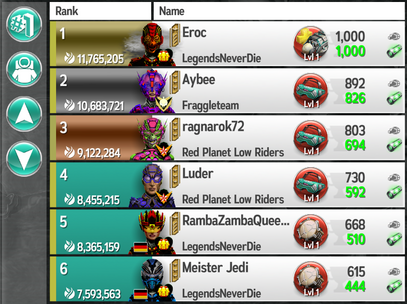
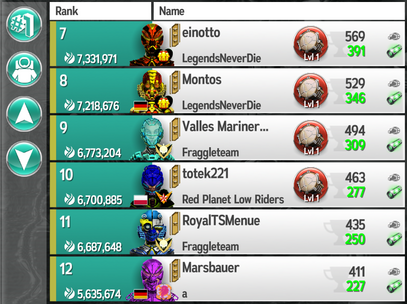

# Игрокам Rail Nation

Эта игра имеет много схожего с игрой Rail Nation, разработанной компанией Bright Future (подразделение Travian Games). И это совсем не случаное сходство!
Основатель компании Gamefabrik, разработчика Mars Tomorrow, 7 лет проработал в Bright Future.

Однако внешнее сходство крайне обманчиво. Очень многие вещи тут реализованы иначе или имеют существенные особенности. Предыдущий опыт железнодорожный
опыт может оказаться полезным, может помочь быстрее понять, что тут к чему.

## Игровой раунд

Как и RN, эта игра является раундовой. Каждый раунд разделён на 8 фаз по 10 дней (на x2-сервере по 5 дней) и отдельно аналог финала - "финишная прямая". Таким
образом, раунд длится 83 (43) дня.

На самом деле аналог "финала" не слишком выделяется на фоне раунда. В нём только действует бонус к доходам и исследованиям, а также увеличено число зарабатываемых
в колониях террапунктов, благодаря чему можно более комфортно поиграть в конце и подзаработать на личный рейтинг. Какого-либо соревнования колоний в финале нет,
и бонусов за топ-колонию тоже не предусмотрено.

На карте планеты 36 колоний, расположенных в узлах квадратной сетки 6x6. Однако высадка всегда осуществляется в одну из четырёх центральных колоний. В дальнейшем,
по мере развития игроков, можно будет начать заниматься развитием и других колоний. По задумке разработчиков - вообще всех. Но в игре слишком мало игроков, и
значительная часть колоний так и остаётся 1 уровня. Можно полностью переехать в другую колонию, можно апать другие колонии без смены родной. Всё это должно быть
знакомо и понятно машинистам.

## Производства, пересчёт, апы

В качестве производств выступают заставы (аванпосты, outpost). Тут тоже есть подвозы, они тут тоже помогают снижать время загрузки (ВЗ). Однако застава может производить несколько
разных ресурсов. Например, лаборатория электролиза производит водород и кислород, а в последующих фазах также хлор (ВЗ).

За исключением нескольких начальных лабораторий, все остальные заставы не появляются автоматически. По умолчанию у них уровень 0, и чтобы начать их использовать,
их нужно построить (апнуть до уровня 1). Это надо делать с помощью дронов (но частично можно ускорить инвестициями).

Потребление в городе происходит каждые 5 минут. Одновременно с ним происходит пересчёт загруженности на производствах. ЗЧ тут не бывает - нет никакого смысла
чего-то ожидать от 5 минут низкого ВЗ. Тем более, что и собственно нулевого ВЗ тут не бывает: в нераспечатанной заставе действует базовое ВЗ 30 секунд.

Ап колоний тут тоже отличается от привычного. Ресы зеленеют при 50% загрузке склада. Однако на этом колония не повышает уровень. При зелёном уровне в неё начинают
прибывать колонисты. И пока не наберётся нужное количество колонистов, колония не повысит уровень. Чем сильнее уровень ресов превышает 50%, тем выше тенденция
прироста колонистов, но 5-10-20 часов апа тут это норма (в зависимости от активности игроков и правильности их действий). Любителей быстрых апов это очень расстроит.
А игроки, которые не могут сочетать работу и личную жизнь с частым посещением игры, могут наоборот порадоваться: здесь не нужно так много активности для того,
чтобы приносить пользу.

Кстати, ресы каждой фазы выпадают в любом порядке. Тут нет такого, что у реса есть минимальный уровень, на котором он выпадает. Поэтому получить нераскачанный
подвоз тут абсолютно рядовая ситуация. Также с учётом этого игроки вынуждены сразу же после начала фазы заранее отправлять дроны строить все новые заставы,
потому что это занимает несколько часов, а что выпадет при очередном апе неизвестно.

## ВО, подвозы

[ВО](wt.md) (тчнее, ВЗ - время загрузки) тут считается по другим принципам, некоторые из которых покажутся непривычными. Базовое ВЗ 30 секунд, но нет никакого отрицательного значаения от загруженности,
её вклад всегда положителен. ВЗ не зависит от запасов на складе, зато зависит от соотношения подвоз-вывоз. Если оно ниже 50%, корректировка ВЗ имеет положительное
значение, если выше 50% - отрицательное. Своего рода аналог интеграции в RN. При высоком подвозе можно сократить ВЗ очень существенно, поэтому в этой игре принято
стоять с полным подвозом, но всего по одной цепочке ресов (неважно какой рес подвозить - запас на складе не влияет). Есть инвестиции личные (shares)
и сумма инвестиций гильдии (guild shares), а также КП (leading guild). Кроме того, есть ещё интересные механики на основе дронов (сокращают ВЗ игроку и преимушество
в числе дронов на конкретной заставе перед другими гильдиями сокращает ВЗ всей гильдии) и "пожар" (прибавляет 120 секунд к ВЗ всем, его надо тушить совместно с помощью
дронов). Также гильдия может заявить права на один аванпост (это называется claim) и получить на нём дополнительное снижение ВЗ.

## Транспортёры, дроны, лицензии

[Ресы](goods.md) тут перевозят [транспортёры](transporters.md). В отличие от RN, их всего 4 вида в каждой фазе: универсальный и три специализированных. Специализированные более эффективны, чем
универсальный, на конкретных классах ресурсов, но уступают ему на остальных ресурсах. Игра на спецтранспортёрах - это отдельный вид экзотического развлечения, которое
не имеет смысла для новичков. Во-первых, на них придётся потратить много дополнительных ОИ, которые ещё предстоит собрать, что не очень-то просто.
Во-вторых, подвозы к этим ресурсам будут иметь несовместимые типы, поэтому придётся строить весьма замысловатые маршруты, чтобы обеспечить подвоз нужных ресурсов
к соответствующим заставам, используя транспортёры подходящего типа. В-третьих, в игре нет музея, поэтому в случае необходимости придётся полностью заменять транспортёры,
а это экономически невыгодная операция.

Механика транспортёров немного отличается. У них 4 характеристики: вместимость (capacity), скорость (speed), надёжность (reilability), эффективность (efficiency).
Аналога ускорения нет. Самая незнакомая характеристика - это эффективность: она сокращает время погрузки, то есть это дополнительный множетель к ВЗ для конкретного
транспортёра.

Есть премиумные транспортёры, не требующие слотов в ангаре. Их называют "прототипами". Достать их можно в контейнерах или довольно дорого за премвалюту (тритий).

В игре также есть [дроны](drones.md): они нужны для строительства застав, для тушения пожаров для них, они могут дополнительно уменьшать ВЗ. В поздних фазах есть ещё шпионы
и антишпионы, они воруют или наоборот не дают украсть часть дохода других игроков на производстве.

Лицензии - аналог вагонов. Кстати, транспортёры и лицензии продаются за 25% стоимости (а не 70%, как в RN), поэтому запасать в них деньги не имеет особого смысла.

## Улучшения транспортёров, плагины

В отличие от RN, тут исследованые улучшения сразу применяются к транспортёрам по факту их изучения, ничего платить за это не надо. Разве что только скорректировать
маршруты под изменившуюся тягу. Но это касается заранее купленных траснпортёров. Если улучшения уже изучены, то купить новый транспортёр обойдётся дороже. Так что
может быть интересно менять транспортёры до изучения улучшений, но ложка дёгтя состоит в том, что стоковый транспортёр хуже полностью изученного транспортёра
предыдущей фазы. Вообще, это кажется некоторой недоработкой разработчиков.

Кроме улучшений, есть [плагины](plugins.md) (модули, plugins). Это специальные улучшения, которые могут давать один или несколько эффектов. Плагины можно получать в качестве бонусов
либо купить в магазине за чатлы. Крайне сложно подобрать одинаковый набор плагинов, поэтому чаще всего характеристики парка транспортёров неодинаковы, даже если набрать их
полный комплект на все транспортёры (что крайне рекомендуется). Плагины можно перебирать и улучшать на фабрике плагинов. Иногда плагины имеют ограниченный срок действия.

В обычных транспортёрах 1 слот для плагина, в прототипах (премиумных) - 2 слота.

Помимо плагинов к транспортёрам, существуют плагины на скафандр игрового персонажа. До 8 штук. Правда, слоты эти разного типа: два обычных (белых), два бонусных (жёлтых, требуют
активного премиумного аккаунта), четыре особых (синих) для особых (каких именно?) плагинов. Но плагины игрока имеют ограниченный срок действия намного чаще, чем плагины
к транспортёрам, причём хорошие ограничены практически всегда.

## Транспортная сеть, перееезд

Тут не надо строить рельсы и долго ждать. Вместо этого надо устанавливать на заставы и колонии передатчики. После установки в какой-то узел передатчика становятся доступны
все соседние узлы. Причём сразу, не нужно часами ждать завершения строительства. Но число передатчиков ограничено уровнем командного центра, и их стоимость растёт.

Переезд требует 6 часов (x2 - 3 часа). В домашней колонии игрок получает 25% бонуса террапунктов. Но слишком часто переезжать и рубить много очков на домашнем бонусе не получится -
длинный переезд специально против этого и задумывался.

## Чатлы, энергия, тритий, аккаунт поселенца, контейнеры

Чатлы (марсодоллары, marsdollars) - основная валюта игры, которую можно зарабатывать на перевозках. Их обозначают перечёркнутой горизонтально буквой <s>M</s>.

Энергия используется для переработки плагинов и для временного бонуса зданий хабитата.

Тритий - местный аналог золота. Он копится не особо быстро.

Аккаунт поселенца (settler account) - аналог плюс-пакета. В составе есть удвоенный банк, +25% скорости исследований, две стройки, расширенные функции управления транспортёрами - короче,
чувство дежа вю особенно сильно. И в коде игры он называется PlusAccount, что тоже явно неспроста. Стоит 200-450-900 трития на 10-30-90 дней. В целом, активный игрок может за раунд
заработать 900 трития на следующий раунд, но это всё равно несколько сложнее, чем при типовой предварительной высадке в RN. Не очень активный заработает примерно половину этой величины,
совсем пассивный где-нибудь сотню-две. Немного интереснее на x2-сервере: там 900 трития позволяют получить аккаунт сразу на 2 раунда вперёд. В любом случае, покупать пакет за 200-450
трития совершенно невыгодно и я категорически не рекомендую. Проще лишний раунд пострадать и потом уже сыграть с комфортом от начала и до конца.

## Очки Земли, метаочки

Вместо престижа тут очки Земли (террапункты, ТП, terrapoints, TP). Они начисляются каждые 6 часов, а не раз в сутки, как в RN.

Однако по итогам раунда игроки получают не террапункты, а так называемые метаочки (metapoints). Топ-1 получает 1000, дальше по убыванию. Также по итогам раунда игроки получают тритий.
Топ-1 получает 1000 трития, остальные по убыванию, но количество трития и метаочков у игроков неодинаково. Тритий идёт в следующий раунд вместе с остатком аккаунта поселенца,
метаочки идут в местный аналог карьеры, в которой получают звание, начиная с новичка (rookie). Никакого аналога карьерного локомотива нет.

Результаты одного из раундов, где видны террапункты, метаочки и заслуженный тритий, а также красные плагины у топ-10:

 

Вместо билетов тут "потерянные и найденные" (lost and found) контейнеры. Иногда выпадают бесплатные. Но в основном, конечно, за тритий.

## Место обитания

Вместо станции тут "место обитания" (habitat). На нём есть очень знакомые по функционалу здания:

- Депо - [ангар (hangar)](habitat/hangar.md) - управляет лимитом на транспортёры.
- Строительный двор - тут тоже так называется (construction yard).
- Ресторан, торговый центр - криптомайнер/криптошахта и апартаменты (cryptominer, apartments) - дают чатлы.
- Банк - тут тоже банк, хотя его могут называть и "сейф", так как в английской версии он называется safe.
- Лаборатория - исследовательский институт (research institute) - даёт очки исследования (выглядят как микроскопы).
- Отель - очистительный завод (refinery) - даёт террапункты.
- Рельсовый завод - командный центр (COM center) - управляет лимитом на передатчики.

Есть несколько зданий, которые специфичны для этой игры и не имеют аналогов.

У криптомайнера и очищалки можно изменить интервал выдачи бонуса с 3 часов на 1 час (повышает доход в час на 20%) или на 10 часов (понижает на 20%). Это позовляет на ночь
выставить побольше и не так потерять от недобора бонусов, а днём, в часы наибольшей активности, получать наоборот больше. Интересное решение.
Хотя в активных гильдиях всё равно лучшая стратегия это держать самый короткий (часовой) интервал постоянно, потому что кто-нибудь есть онлайн в игре значительную часть суток.
Одновременно со сбором бонусов можно включить игроку 3 часа дополнительного бонуса за энергию. Это делать полезно, но никто не обидится, если игрок будет делать бонус только
себе, потому что количество энергии ограниченно, и его может не хватать.

Никаких вознаграждений за сбор чужих бонусов не предусмотрено. Интересно, что в этой игре можно снимать бонусы не только у членов своей гильдии, но и у любого игрока.
Но это не особо осмысленно, так как по сути помогаешь конкурентам.

Апартаменты, в отличие от криптомайнера, не выдают бонус раз в час, а накапливают его постоянно, но не более 48 часов. Поэтому в них можно запасать деньги. Правда, при невысоком
уровне апартаментов много в них не накопишь. В отличие от остальных бонусных зданий, другие игроки не могут снимать бонус апартаментов игрока.

Некоторой неожиданностью будет нефиксированная цена строительства зданий. Чем раньше их строишь, тем дороже они обходятся.

## Гильдии

Да, гильдии тут есть - как и в любой онлайн-игре с социальным взаимодействием. В гильдии 20 мест прям на старте раунда. Однако, прокачивая уровни гильдии, можно получать дополнительные
бонусы.

Тут тоже есть КП, кроме того, есть механики на основе наличия гильдейских дронов и механика "клейма" (claim): гильдия может "заявить" свои права на заставу, и тогда через некоторое время
она получит на ней дополнительный бонус к ВЗ по итогам "выборов". Выигрывает та гильдия, которая больше всех возит. Поскольку клейм может быть только один, обычно выбирают заставу, которая
нужна в цепочке подвозов у нескольких текущих ресов либо какой-то нужный плохо раскачанный рес.

## Задания по доставке

В RN некоторые очень любят сорики. И тут они тоже есть! Правда, по неясной причине в русской версии их назвали "тендерами". Но ведь это же просто гонки (delivery races)!

Играть гонки как сорики в RN проблематично. Во-первых, у транспортёров неодинаковые характеристики за счёт плагинов. Собрать плагины одинакового типа довольно сложно и не особо осмысленно:
зачем отказываться от хорошего редкого плагина? Во-вторых, из-за частого пересчёта (каждые пять минут) определить время круга очень сложно. В-третьих, тут есть то, что вы никогда не видели:
гонки часто идут на нескольких ресах одновременно! Да, придётся завести нужное количество всех. В целом, есть где применить смекалку и подыскать хорошую стратегию, но разница в соревновательной
технике очень даже чувствуется.

Кроме гонок, есть персональные задания на доставку. Это что-то типа личного сорика без ограничение на время выполнения. Их часто принято возить прямо с подвозами: поскольку ни с кем не
соревнуешься, то нет и смысла сильно спешить. А подвозы позволят поддерживать запасы на складах и не повышать ВЗ себе и другим игрокам. Кстати, такие задания иногда бывают заданиями на поставку
не в колонию, а на конкретное производство.

Весьма неожиданно, что в гонках и персональных заказах участвовать очень важно, особенно в тех, где дают деньги. Дело в том, что их тут в призе выдают очень много, а чисто на транспортировке
даже на основную программу развития тяжело накопить. Ну и сами посудите: допустим, транспортёры зарабатывают 2кк в час, то есть 48кк в сутки. И тут выпадает личный заказ на 18кк и гонка на
30кк, то есть можно получить ещё один суточный доход. Как тебе такое, Илон Маск?

## КпК

Здесь есть и аналог ГС - "колонии против колоний" (КпК, colo vs colo). Но они очень странные, пока что из всего увиденного это была самая удивительная вещь в этой игре. Во-первых,
они идут 48 часов. Да-да, серьёзно, 48 часов! В том числе и на x2-сервере! Во-вторых, при апе колонии в них также не меняются ресы. Да-да, если быстро апнешься, то добро пожаловать
таскать до посинения ушедшие ресы. В-третьих, из-за длительности в них катают ресы с подвозами. По больщому счёту КпК могут вредить развитию игроков и мешать росту колоний. Но в них
всё равно имеет смысл участвовать, ибо есть интересные бонусы:

- Во-первых, жители города получают бонус до 50% в террапунтках за поставки в него.

- Во-вторых, в зависимости от личного места в поставках можно получить несколько контейнеров с неплохими призами.

Хотя есть и другое мнение на этот счёт: наоборот, не участвовать в КпК в начальных фазах. Ибо бонусы в абсолютном выражении пока не особо большие, а личные призы плюс-минус 1-2 контейнера
не особо влияют. Всё равно игроков мало. Поэтому можно какое-то время потаскать и получить свои 4-5 контейнеров совсем не напрягаясь. Шансы словить Эксельсиор (премиумный прототип
ограниченного срока действия, который выпадает только в КпК) весьма мизерные.
