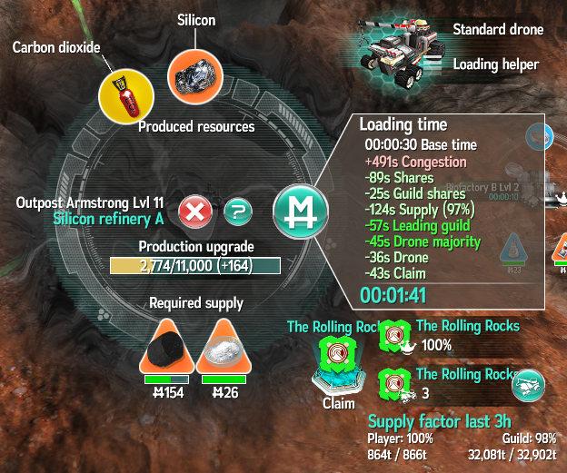
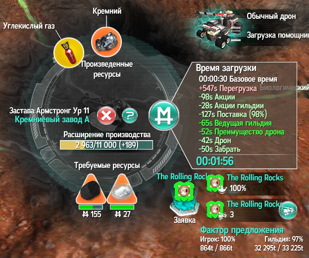

# Время загрузки

Одним из важнейших средств регулирования игрового баланса является время загрузки (loading time) на производствах. Считается, что транспортировка
любого товара включает путь "туда" и "обратно", а также ожидание погрузки в зависимости от количества перевозимых игроками ресурсов.

Время загрузки зависит от множества факторов и очень существенно влияет на общую эффективность транспортировки. Оно своё на каждом производстве
и индивидуально для каждого игрока и каждого транспортёра в зависимости от характеристик, плагинов, инвестиций итд итп.

Основные составляющие:

- Базовое время - 30 секунд;
- Перегрузка (congestion - "толкучка", загруженность) - прибавка от активности вывоза;
- Инвестиции (shares);
- Инвестиции гильдии (guild shares);
- Подвоз (supply) - сокращает время погрузки в зависимости от соотношения ввоза-вывоза;
- Преимущество гильдии по инвестициям (leading guild) - дополнительное сокращение для членов гильдии с наибольшим числом инвестиций;
- Преимущество по дронам (drone majority) - ещё одно сокращение для гильдии с наибольшим числом дронов на этом производстве;
- Дрон (drone) - сокращение для производства, на котором установлен дрон игрока с соответствующим эффектом (стандартный дрон или турбо).
- Заявленное гильдией производство, "клейм" (claim) - ещё одно сокращение для одного выбранного производства.

Из всех этих составляющих базовое время и загруженность имеют положительное значение, а подвоз будет давать положительное значение при
соотношении подвоз/вывоз менее 50% и отрицательное при более 50%. Остальные дают отрицательное значение и позволяют уменьшить время. Ещё
есть "пожар", во время которого к времени на конкретном производстве добавляется 120 секунд. Пожар надо тушить с помощью дронов.

С увеличением уровня производства оно начинает отдавать товар всё лучше, поэтому перегрузка при таком же вывозе становится ниже. В процессе
игры производства должны повышать уровень и становиться всё эффективнее. Также для увеличения эффективности вывоза следует [поставлять](supply.md)
необходимые товары, в количестве, примерно равном вывозу. Это надо делать всем игрокам. Неважно, какой товар подвозить, учитывается
только соотношение ввоз-вывоз.

Для сравнения - русскоязычный вариант. Обратите внимание, как криво переведены названия некоторых характеристик.

